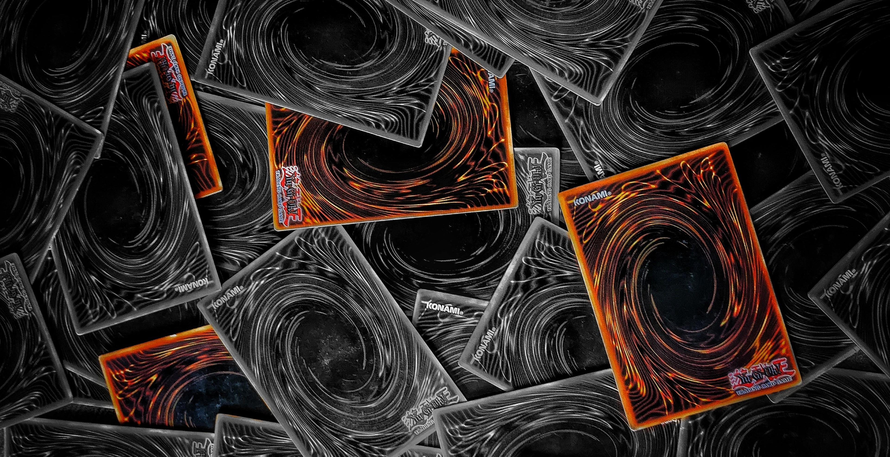

## ⚡️🎴 Yu-Gi-Oh! Legacy Rules 🎴⚡️  

>#### ✨ Reglas Clásicas & Personalizadas para Duelos Épicos ✨

¡Bienvenido a **YuGiOh Legacy Rules**, un conjunto de reglas nostálgicas para jugar *Yu-Gi-Oh!* con un enfoque clásico! Basadas en la era de *Synchro* y anteriores, estas reglas buscan crear un equilibrio entre cartas antiguas y nuevas mediante principios de teoría de juegos.

> Perfecto para duelos más estratégicos y nostálgicos.

## 🚩 **Reglas Principales**

1. **🧙‍♂️ Restricción de Invocaciones Especiales**  
   - Máximo **5 invocaciones especiales (maximo 3 del extra deck)** por turno.

2. **⚔️ Prohibición de Mecánicas Modernas**  
   - ❌ No se permiten *Pendulum* ni *Link Monsters*.  
   - ✅ Se permiten *XYZ Monsters* con un límite de **1 invocación por turno**.

3. **📜 Límite de Cartas Boca Abajo**
   - Máximo de **3 cartas boca abajo** en el campo.

4. **🛡️ Compensación por Mecánicas Modernas**  
   - Los jugadores que utilicen *XYZ Monsters* empiezan con **6000 LP** en lugar de 8000.

## 🔥 **Sistema de Maná**

Cada jugador comienza su turno con **5 puntos de maná**. Este maná se reinicia al comienzo de cada turno. Todas las invocaciones y ciertos efectos de cartas consumen maná según el tipo y el nivel del monstruo o la acción.

### Costos de Maná

1. **Invocaciones Normales** 🔄 (incluye tributo):
    - Nivel 1-12: **0 punto de maná**

2. **Invocaciones Especiales** (incluye xzy, sincronización, fusión):
    - Nivel 1-4:   **1 punto de maná**  🔵
    - Nivel 5-6:   **2 puntos de maná** 🔵🔵
    - Nivel 7-8:   **3 puntos de maná** 🔵🔵🔵
    - Nivel 9-10:  **4 puntos de maná** 🔵🔵🔵🔵
    - Nivel 11-12: **5 puntos de maná** 🔵🔵🔵🔵🔵

3. **Invocaciones Rituales**:
    - Nivel 1-12: **1 punto de maná** 🔵

#### 🎮⚔️ Ejemplo de Turno

- Al inicio del turno, el jugador tiene **5 puntos de maná**.
- Invoca normal un monstruo de **Nivel 4**, gastando **0 maná**.
- Invoca especialmente un monstruo de **Nivel 4**, gastando **1 maná**.
- Activa el efecto de una carta mágica que permite una **invocación especial** de un monstruo de **Nivel 7**, lo que cuesta **3 puntos de maná**.
- Queda con **1 punto de maná** para hacer la invocacion de un ritual.

## 🌟 **Objetivo de las Reglas**

Estas reglas están diseñadas para equilibrar las cartas modernas y clásicas, manteniendo el juego más estratégico y táctico, con un enfoque en la **diversión** y la **nostalgia** de la era *Synchro*.

¡Prepárate para revivir tus mejores duelos! 🔥

## 💡 **Cómo Usar estas Reglas**

1. Invita a tus amigos a una partida con estas nuevas reglas.
2. Usa cartas de cualquier generacion, *Te aseguramos que esos mazos nuevosrarisimos ya no pareceran trampa*.
3. ¡Disfruta de un juego equilibrado y lleno de estrategia!
4. 🧪 Usa **EdoPro** para simular duelos entre diferentes mazos y experimentar estas reglas en acción.

## 📸 **Galería de Ejemplos**

  

## 📜 **Licencia**

Este proyecto está bajo la [Licencia MIT](LICENSE).

## 👥 **Contribuciones**

¡Cualquier sugerencia para mejorar estas reglas es bienvenida! Siéntete libre de crear una *issue* o enviar un *pull request*.

> ¡Que los duelos sean eternos! ⚔️🃏
